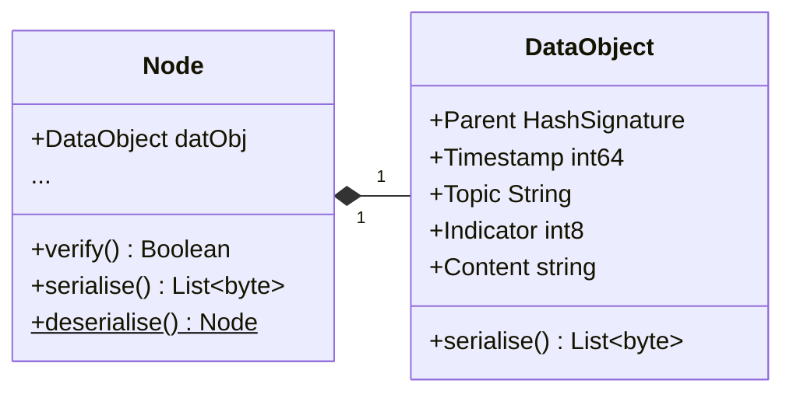

# Class Diagram for the DataObjects struct

`security/node.go`

```mermaid
classDiagram
    direction LR
    class Node {
        +DataObject datObj
        ...

        +verify() Boolean
        +serialise() List~byte~
        +deserialise()$ Node
    }
    class DataObject {
        +Parent HashSignature
        +Timestamp int64
        +Topic String
        +Indicator int8
        +Content string

        +serialise() List~byte~
    }

    Node "1" *-- "1" DataObject
```
