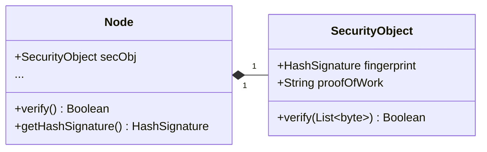

# Class Diagram for the SecurityObject struct

`security/security.go`

```mermaid
classDiagram
    direction LR
    class Node {
        +SecurityObject secObj
        ...

        +verify() Boolean
        +getHashSignature() HashSignature
    }
    class SecurityObject {
        +HashSignature fingerprint
        +String proofOfWork

        +verify(List~byte~) Boolean
    }

    Node "1" *-- "1" SecurityObject
```
