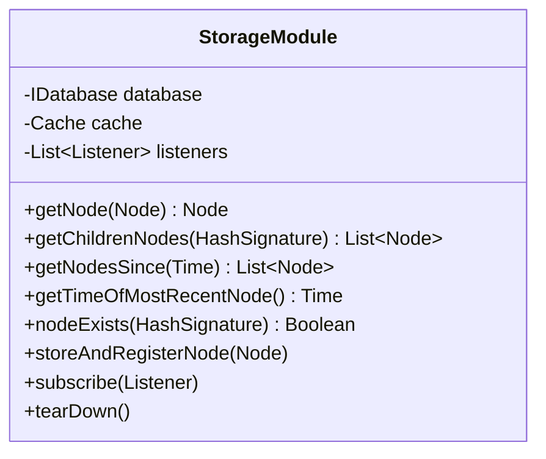

# Class Diagram for the SecurityObject struct

`storage/storage.go`

```mermaid
classDiagram
    class StorageModule {
        -IDatabase database
        -Cache cache
        -List~Listener~ listeners

        +getNode(Node) Node
        +getChildrenNodes(HashSignature) List~Node~
        +getNodesSince(Time) List~Node~
        +getTimeOfMostRecentNode() Time
        +nodeExists(HashSignature) Boolean
        +storeAndRegisterNode(Node)

        +subscribe(Listener)

        +tearDown()
    }
```
