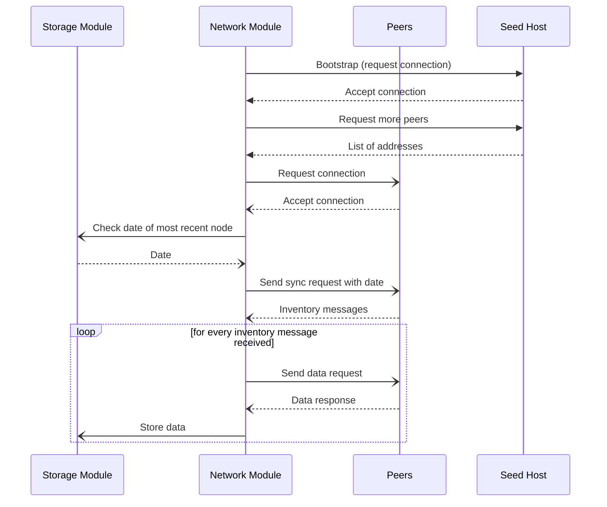

```mermaid
sequenceDiagram
    participant SM as Storage Module
    participant N as Network Module
    participant P as Peers
    participant S as Seed Host

    N->>S: Bootstrap (request connection)
    S-->>N: Accept connection
    N->>S: Request more peers
    S-->>N: List of addresses
    N-)P: Request connection
    P--)N: Accept connection
    N-)SM: Check date of most recent node
    SM--)N: Date
    N-)P: Send sync request with date
    P--)N: Inventory messages
    loop for every inventory message received
        N-)P: Send data request
        P--)N: Data response
        N-)SM: Store data
    end
```
