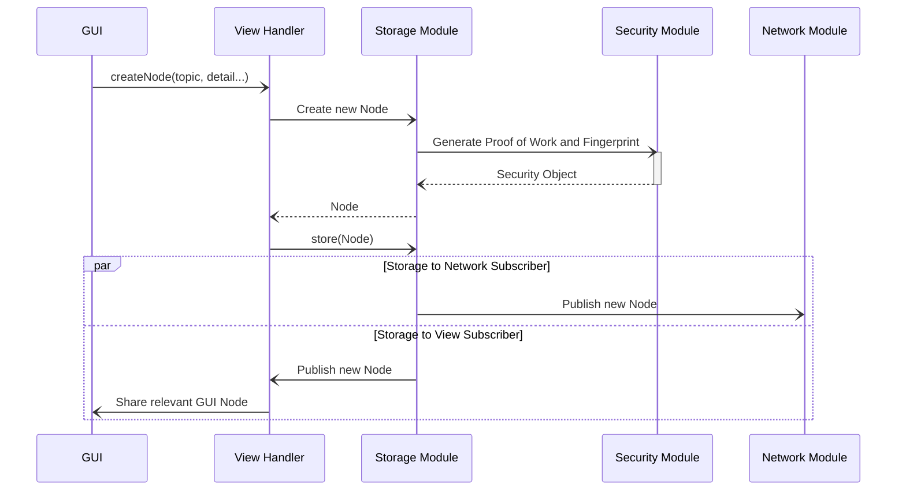

```mermaid
sequenceDiagram
    participant GUI
    participant VH as View Handler
    participant SM as Storage Module
    participant SEC as Security Module
    participant N as Network Module

    GUI-)VH: createNode(topic, detail...)
    VH-)SM: Create new Node
    SM-)SEC: Generate Proof of Work and Fingerprint
    activate SEC
    SEC--)SM: Security Object
    deactivate SEC
    SM--)VH: Node
    VH-)SM: store(Node)
    par Storage to Network Subscriber
        SM-)N: Publish new Node
    and Storage to View Subscriber
        SM-)VH: Publish new Node
        VH-)GUI: Share relevant GUI Node
    end
```
