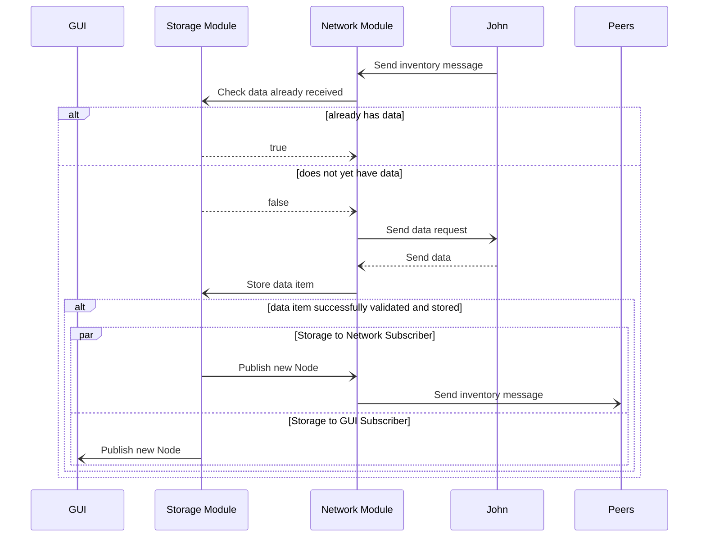

```mermaid
sequenceDiagram
    participant GUI
    participant SM as Storage Module
    participant N as Network Module
    participant P as John
    participant PS as Peers

    P-)N: Send inventory message
    N-)SM: Check data already received
    alt already has data
        SM--)N: true
    else does not yet have data
        SM--)N: false
        N-)P: Send data request
        P--)N: Send data
        N-)SM: Store data item
        alt data item successfully validated and stored
            par Storage to Network Subscriber
                SM-)N: Publish new Node
                N-)PS: Send inventory message
            and Storage to GUI Subscriber
                SM-)GUI: Publish new Node
            end
        end
    end
```
